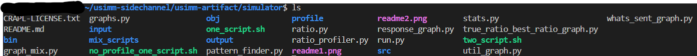

# ASPLOS Artifact :
The most computainally expensive part of running this simulation is performing the profiling stage. 
Depening on your system it can take anywhere between 1 to 3 days. Using a 32Gb system with an Intel i7-13700k, profiling took XX hours.
As we show in our paper, only a select programs benifit from profiling as such we provide a path assuming profiling has been done. 
Using the no_profile script can be used in case of time or system constraints.
We also provide the ability to perform the profiling from scatch if wanted.

### Import Traces:
1. Download input.tar.xz, extract the contents into a folder named `input` (you may have to create this) at the root of the of the simulator. It must be named exactly `input` and contain everything that is included in the tarball. 
2. Test: typing `ls` at the root of the project should look something like this:
   1. 
3. Test: tying `ls` inside the `input` folder should look something like this
   1. 
### Building:
1. `cd src/`
2. `make clean`
3. `make all`
4. `cd ..`

### Profiling Steps:
Skip this if you want to use the preprofiled version.
1. run `one_script.sh` (you may need to give it execute permissions `chmod +x one_script.sh`)
### No-Profiling steps:
1. run `no_profile_one_script.sh` (you may need to give it execute permissions `no_profile_one_script.sh`)
2. This will only work if you:
   1. Have not ran `one_script.sh`, as it overrides the provided profiled data.
   2. Have ran `one_script.sh`, but let it finish profiling.
   3. If you have ran `one_script.sh` and did not let the profiling finish and do not want to profile, redownload the repo and start over.

Both these methods will save a handful of figures that can be compared with the paper. 
As this is a traced based, cycle accurate simulation the results should be exactly the same.

### Mixed Benchmakrs:
We assume all programs are already profiled by the time we get here
1. run `mixed_script.sh`

Original USIMM readme:
------------------------------------------------------------------------------
USIMM: the Utah SImulated Memory Module
Version 1.3

USIMM is distributed under the CRAPL (see CRAPL-LICENSE.txt
in this directory).  In spite of the tongue-in-cheek terms of
the license, we will be supporting the USIMM infrastructure.  
The src/utlist.h file was obtained from http://uthash.sourceforge.net
and is subject to the terms of the BSD license.
For questions to the USIMM developers, email usimm@cs.utah.edu 
For updates or discussions, email usimm-users@cs.utah.edu,
or visit this blog post: http://utaharch.blogspot.com/2012/02/usimm.html

USIMM was developed by members of the Utah Arch group:
Niladrish Chatterjee, Rajeev Balasubramonian, Manjunath Shevgoor,
Seth H. Pugsley, Aniruddha N. Udipi, Ali Shafiee, Kshitij Sudan, Manu Awasthi.

We also received traces and suggestions from other JWAC MSC organizers:
Zeshan Chishti (Intel), Alaa R. Alameldeen (Intel), Eric Rotenberg (NC State)

Code download: http://www.cs.utah.edu/~rajeev/usimm-v1.3.tar.gz

USIMM Tech Report: http://www.cs.utah.edu/~rajeev/pubs/usimm.pdf

The JWAC MSC website: http://www.cs.utah.edu/~rajeev/jwac12/
------------------------------------------------------------------------------

GETTING STARTED
---------------

If you've reached this far, you've already been able to unzip and
untar the distribution with:
gunzip usimm-v1.3.tar.gz
tar xvf usimm-v1.3.tar

The root directory has the following directories and files:
src/      : Code source files
bin/      : Houses the usimm executable
obj/      : Houses the intermediate object files for the source files
input/    : Has the (simulated) system configuration files and input traces
output/   : Can store the simulation outputs
runsim    : A script to execute a few example simulations
README.txt: this file!
usimm.pdf : The USIMM tech report
CRAPL-LICENSE.txt: The CRAPL license.

To get started, 
cd src/
make clean
make

This produces a usimm executable in the bin/ directory.  To run the
example simulation script,
cd ..
./runsim

The simulation should finish in tens of minutes.  Use a truncated version of
the trace files for shorter tests.  To examine the simulation outputs,
view output/*

The input/ directory contains the system and DRAM chip configuration
files that are read by USIMM.  Do not rename this directory or
the DRAM chip configuration files.  The input/ directory also
contains 13 trace files for 10 different benchmarks.  Please see
Appendix C of the USIMM Tech report for details on these benchmarks.

CODE ORGANIZATION
-----------------

The src/ directory has the following files:

main.c : Handles the main program loop that retires instructions,
fetches new instructions from the input traces, and calls update_memory().

memory_controller.c : Implements update_memory(), a function that checks
DRAM timing parameters to determine which commands can issue in this cycle.

scheduler.c : Function provided by the user to select a command for each
channel in every memory cycle.  The provided default is a simple FCFS 
algorithm with periodic write drains.

scheduler.h : Header file for the user's scheduler function.

configfile.h : Header file to enable reading input system config files.

memory_controller.h : Header file to enable DRAM timing management.

params.h : Header file for all system parameters.

processor.h : Header file for the ROB structure that controls the processor.

utils.h : A few utility functions.

utlist.h : Utility functions to manage linked lists.

SAMPLE SCHEDULERS
-----------------

The src/ directory also includes the following example simple schedulers:

scheduler-fcfs.c/h    : Basic FCFS, plus a periodic write drain mechanism.

scheduler-close.c/h   : Precharges banks during idle cycles soon after a column rd/wr.

